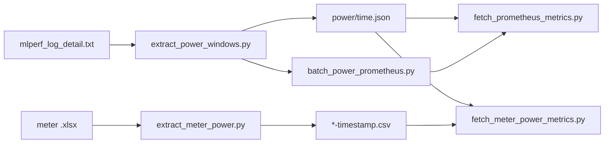

# Power metrics scripts

Utilities for MLPerf Inference vision runs: extract `power_begin` / `power_end` windows from detail logs, write a shared `power/time.json` manifest, then pull aligned time series from **Prometheus** (Kepler) or from an external **power meter** (Excel export).

All paths below are relative to `vision/classification_and_detection/` unless noted.

## Requirements

| Script | Dependencies |
|--------|----------------|
| `extract_power_windows.py`, `fetch_prometheus_metrics.py`, `batch_power_prometheus.py` | Python 3, standard library only |
| `fetch_meter_power_metrics.py` | Python 3, [NumPy](https://numpy.org/) |
| `extract_meter_power.py` | Python 3, [pandas](https://pandas.pydata.org/), Excel reader (e.g. `openpyxl` for `.xlsx`) |

`fetch_common.py` and `extract_common.py` are shared modules (not run directly).

## Run layout

Scripts expect output directories produced by containerized runs (e.g. `run_in_container_mounted.sh`). Each **OUTPUT_DIR** (`run_*`, `accuracy/`, etc.) typically contains:

```
run_1/
  logs/mlperf_log_detail.txt   # MLLOG lines with power_begin / power_end
  manifest.json                # optional: node_name, node_arch
  power/
    time.json                  # written by extract scripts
    kepler_node_cpu_joules_total.csv   # example Prometheus output
    meter-platform_power.csv           # example meter output
```

Detail logs use the `:::MLLOG` prefix. Power events are consecutive `power_begin` / `power_end` pairs; each pair is one measurement window.

## Workflow



**Prometheus path:** detail log → `time.json` → range query → wide CSV beside `time.json`.

**Meter path:** meter Excel → `*-timestamp.csv` → resample to the same grid as `time.json` → wide CSV.

**One-shot:** `batch_power_prometheus.py` runs extract + default Kepler fetch for every discovered run.

## Scripts

### `extract_power_windows.py`

Parses `mlperf_log_detail.txt`, finds `power_begin` / `power_end` groups, and optionally writes `OUTPUT_DIR/power/time.json` with Unix/RFC3339 bounds and a `prometheus` block (`start`, `end`, `step`) for downstream fetchers.

```bash
# Inspect windows (stdout)
python3 scripts/extract_power_windows.py /path/to/output/run_1

# All runs under an experiment tree
python3 scripts/extract_power_windows.py /path/to/experiment_root --recursive

# Write time.json (skip if already present)
python3 scripts/extract_power_windows.py /path/to/output --recursive -o

# Replace existing time.json
python3 scripts/extract_power_windows.py /path/to/run_1 -o --overwrite
```

| Option | Description |
|--------|-------------|
| `path` | One or more OUTPUT_DIRs, log paths, or experiment roots |
| `-r`, `--recursive` | Find `logs/mlperf_log_detail.txt` under each path |
| `-o`, `--write-time-json` | Write `power/time.json` per run |
| `--overwrite` | With `-o`, replace existing `time.json` |
| `--step` | Prometheus step stored in JSON (default: `1s`) |
| `--tz` | IANA zone for wall-clock strings (default: `UTC`; `local` supported) |

Exit code `2` when no detail logs or no power pairs are found.

### `fetch_prometheus_metrics.py`

Queries Prometheus HTTP API (`/api/v1/query` or `/api/v1/query_range`). Outputs a **wide CSV** (timestamp column + one column per series) or JSONL/raw JSON.

```bash
# Instant query
python3 scripts/fetch_prometheus_metrics.py --url http://localhost:9090 -q 'up'

# Range query
python3 scripts/fetch_prometheus_metrics.py --url http://localhost:9090 \
  -q 'rate(http_requests_total[5m])' --start 1710000000 --end 1710003600 --step 15s

# Use time.json (sets start/end/step; adds label filters from node_name)
python3 scripts/fetch_prometheus_metrics.py --url http://localhost:9090 \
  --time-json run_1/power/time.json --name-prefix kepler_ --format csv -o

# Single metric beside time.json
python3 scripts/fetch_prometheus_metrics.py --url http://localhost:9090 \
  --time-json run_1/power/time.json -q kepler_node_cpu_joules_total -o
```

| Option | Description |
|--------|-------------|
| `--url` | Prometheus base URL (default: `http://localhost:9090`) |
| `-q`, `--query` | PromQL (repeatable) |
| `--queries-file` | One PromQL per line (`#` comments ignored) |
| `--name-prefix` | Expand to `{__name__=~"^PREFIX.*"}` (repeatable) |
| `--time-json` | Load range + apply `zone=psys` and node filters from manifest |
| `--start`, `--end`, `--step` | Range query bounds |
| `--label-match` | Post-filter series (`KEY=glob` or glob on any label) |
| `--label-key` | Limit label keys used in CSV column names |
| `--format` | `csv` (default) or `jsonl`; `--raw` for full API JSON |
| `-o`, `--output` | File path; with `--time-json -o` alone, writes `{metric}.csv` next to `time.json` |

With `--time-json`, if `node_name` contains `master`, filters use `node_name=*<name>*`; otherwise any label matching `*<name>*`. Without `node_name`, only `zone=psys` is applied.

### `batch_power_prometheus.py`

Batch driver: same discovery as `extract_power_windows.py`, writes `power/time.json`, then fetches one metric (default: `kepler_node_cpu_joules_total`) into `power/<metric>.csv`. Skips fetch when the CSV exists and is newer than `time.json`. Prometheus requests run serially.

```bash
python3 scripts/batch_power_prometheus.py /path/to/experiment --recursive \
  --url http://localhost:9090

python3 scripts/batch_power_prometheus.py /path/to/output/run_1 --url http://prom:9090
```

| Option | Description |
|--------|-------------|
| `--url` | Prometheus base URL |
| `--metric` | PromQL metric name (default: `kepler_node_cpu_joules_total`) |
| `--extract-only` | Only write `time.json` |
| `--fetch-only` | Only query Prometheus (requires existing `time.json`) |
| `--overwrite` | Replace existing `time.json` during extract |

### `extract_meter_power.py`

Reads a meter export `saved_path.xlsx` (filename stem is UTC time, e.g. `2025-01-01T12_00_00Z`), converts meter-local timestamps to UTC, computes `meter-platform_power` as voltage × current, and writes `saved_path-timestamp.csv`. Skips if `*-timestamp.csv` already exists.

```bash
python3 scripts/extract_meter_power.py --saved_path /path/to/data/2025-01-01T12_00_00Z
```

### `fetch_meter_power_metrics.py`

Loads `meter-platform_power` from `extract_meter_power.py` output, aligns samples to the Prometheus grid in `time.json` (nearest neighbor per grid point), and writes the same wide CSV layout as `fetch_prometheus_metrics.py`.

```bash
python3 scripts/fetch_meter_power_metrics.py \
  --meter-power /path/to/2025-01-01T12_00_00Z \
  --time-json run_1/power/time.json -o

# Batch: all time.json under experiment root
python3 scripts/fetch_meter_power_metrics.py \
  --meter-power /path/to/meter-timestamp.csv \
  /path/to/experiment_root --recursive -o
```

| Option | Description |
|--------|-------------|
| `--meter-power` | `*-timestamp.csv` or base path without suffix |
| `--time-json` | Single run; omit to discover runs via positional `path` + `-r` |
| `--max-offset` | Max seconds between grid time and meter sample; empty cells if exceeded |
| `-o`, `--output` | With one `--time-json`, `-o` alone writes `meter-platform_power.csv` beside `time.json` |

## `power/time.json` format

Written by `extract_power_windows.py` / `batch_power_prometheus.py`:

- `run_dir`, `source_log`, `timezone`
- `prometheus`: `{ "start", "end", "step" }` (Unix seconds as strings, step e.g. `1s`)
- `windows`: list of groups with `power_begin` / `power_end`, optional `start_unix` / `end_unix`
- `node_name`, `node_arch` from `manifest.json` when present

## Typical end-to-end examples

**Prometheus (Kepler) for all runs:**

```bash
cd vision/classification_and_detection
python3 scripts/batch_power_prometheus.py /path/to/experiment --recursive \
  --url http://localhost:9090
```

**Prometheus manually (custom metrics):**

```bash
python3 scripts/extract_power_windows.py /path/to/run_1 -o
python3 scripts/fetch_prometheus_metrics.py --url http://localhost:9090 \
  --time-json /path/to/run_1/power/time.json --name-prefix kepler_ -o
```

**External meter:**

```bash
python3 scripts/extract_meter_power.py --saved_path /path/to/2025-01-01T12_00_00Z
python3 scripts/extract_power_windows.py /path/to/run_1 -o
python3 scripts/fetch_meter_power_metrics.py \
  --meter-power /path/to/2025-01-01T12_00_00Z \
  --time-json /path/to/run_1/power/time.json -o
```

## Shared modules

- **`extract_common.py`** — MLPerf log discovery, `manifest.json` fields, `power/time.json` paths, timezone helpers.
- **`fetch_common.py`** — `time.json` loading, Prometheus grid iteration, CSV output naming, label filters for `--time-json`.

These are imported by the scripts above; extend them when adding new fetchers that share the same grid and output layout.
